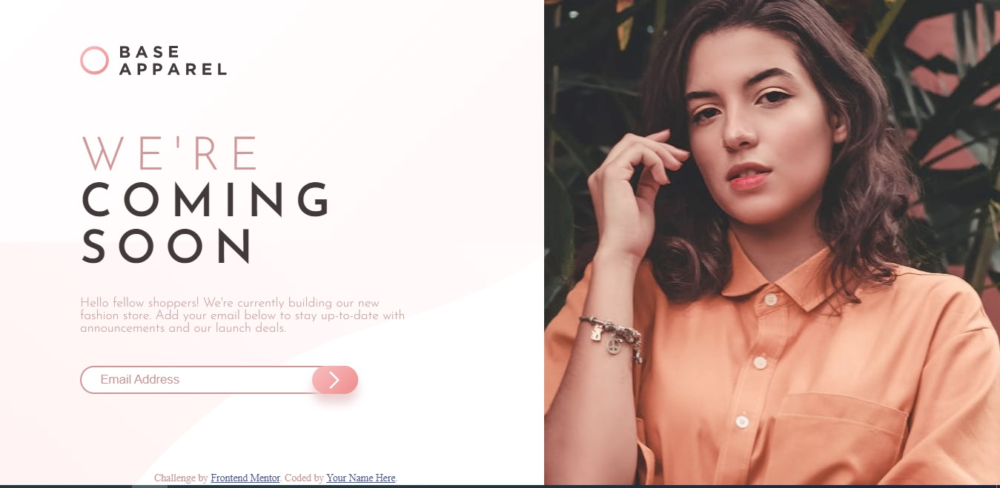

# Frontend Mentor - Base Apparel coming soon page solution

This is a solution to the [Base Apparel coming soon page challenge on Frontend Mentor](https://www.frontendmentor.io/challenges/base-apparel-coming-soon-page-5d46b47f8db8a7063f9331a0). Frontend Mentor challenges help you improve your coding skills by building realistic projects. 

## Table of contents

- [Overview](#overview)
  - [The challenge](#the-challenge)
  - [Screenshot](#screenshot)
  - [Links](#links)
- [My process](#my-process)
  - [Built with](#built-with)
  - [What I learned](#what-i-learned)
  - [Continued development](#continued-development)
- [Author](#author)

## Overview
    I´m aplying my knowledge in Flex, CSS, HTML and responsive design

### The challenge

Users should be able to:

- View the optimal layout for the site depending on their device's screen size
- See hover states for all interactive elements on the page
- Receive an error message when the `form` is submitted if:
  - The `input` field is empty
  - The email address is not formatted correctly

### Screenshot

### Links

- Solution URL: (https://github.com/Hualdop/comingApparel)
- Live Site URL: (https://hualdop.github.io/comingApparel/)

## My process
  With this challenge I´ve learning about responsive design and Flexbox.

### Built with

- Semantic HTML5 markup
- CSS custom properties
- Flexbox
- Mobile-first workflow

### What I learned

I´ve learned about Flexbox and responsive design.

### Continued development

I´d like to learn about Grid and JS

## Author

- Website - [Hualdo](https://hualdop.github.io/Hualcap/)
- Frontend Mentor - [@Hualdop](https://www.frontendmentor.io/profile/Hualdop)
- Twitter - [@Hualdos](https://www.twitter.com/hualdos)

